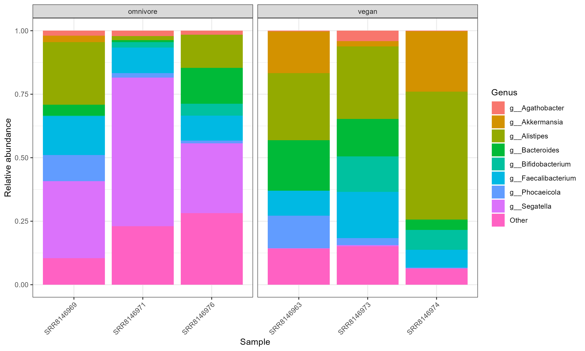
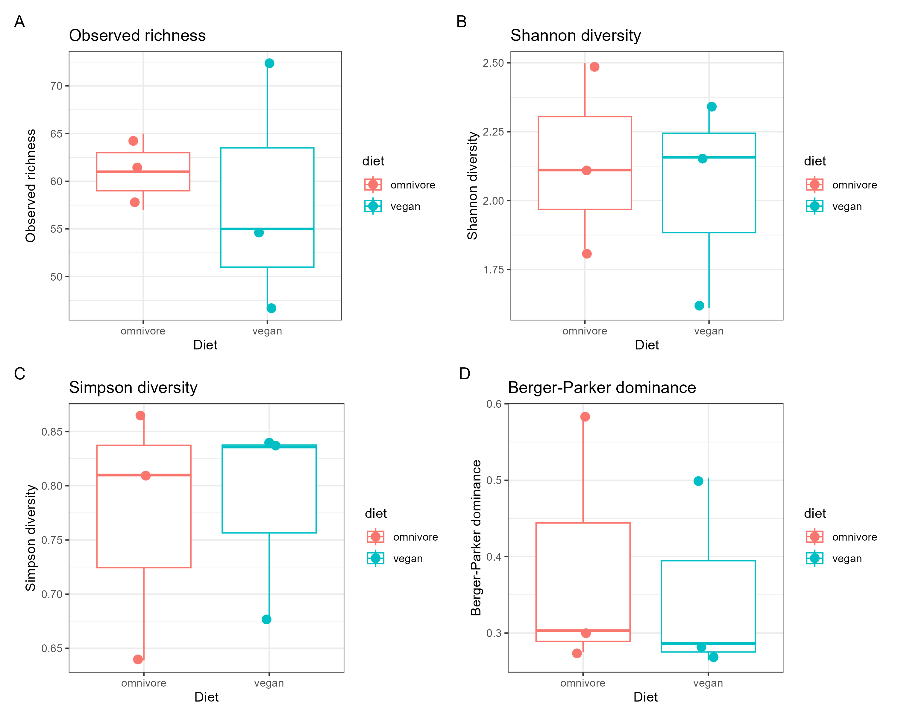
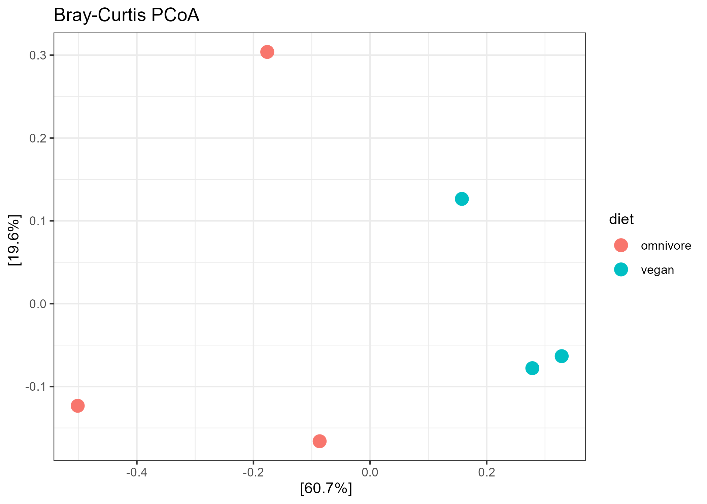
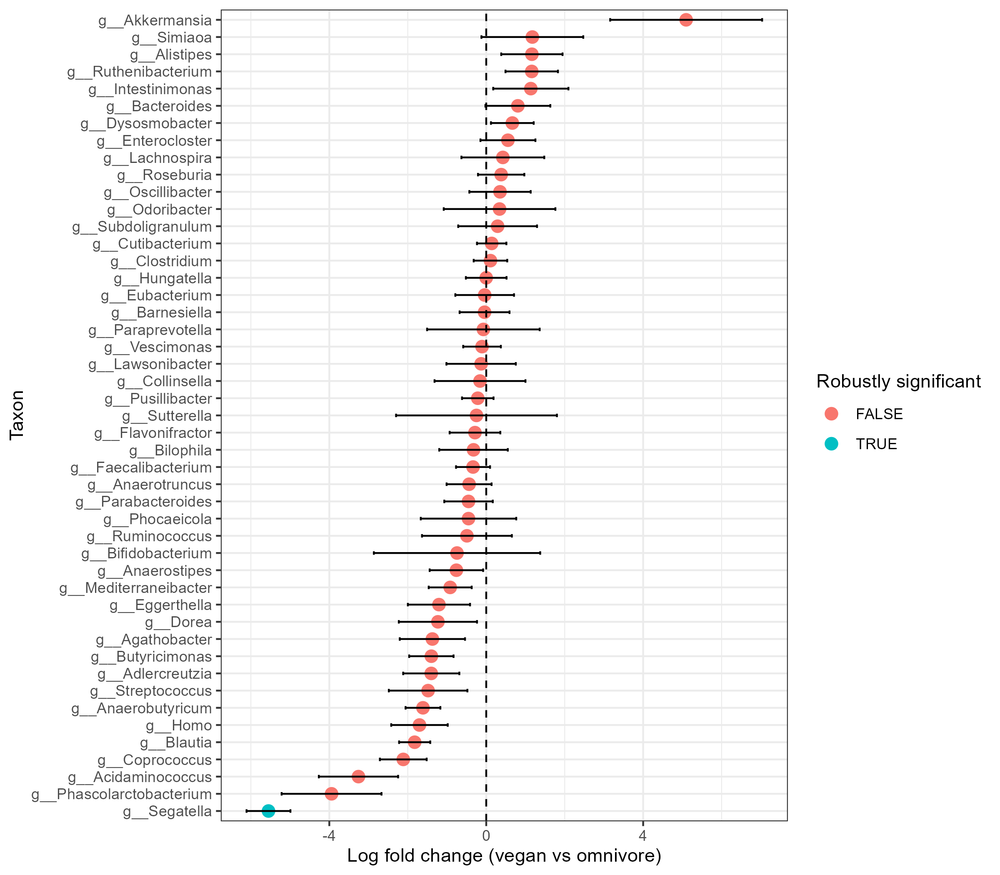

# BINF6110 Assignment 3

## Introduction

The human gut microbiota is a major component of host biology, and diet is one of the strongest factors shaping its composition and metabolic activity. Dietary inputs provide substrates for microbial growth and metabolism, so differences in habitual diet can shift both which microbes are present and what functions they contribute in the gut (Zhang et al., 2025). In the study that produced the dataset used for this analysis, De Filippis et al. examined gut metagenomes from Italians with different habitual diets and found that Prevotella copri showed diet-associated strain-level genetic and functional differences, with fiber-rich diets linked to strains with greater carbohydrate-catabolism potential.

This analysis tests whether gut microbiome composition differs between vegan and omnivore adults on a genus level in the SRP126540 shotgun metagenomics dataset using taxonomic classification, diversity analysis, and differential abundance testing.

Sample pre-processing is essential not only to provide a speedy and efficient response that accommodates the resources available, but also since reliability of results is directly dependent on the quality of the dataset (Terrón-Camero et al., 2022). Quality analysis and need for removal of host data was therefore assessed in this workflow prior to downstream analysis. To understand the general statistics of raw data from a quality control lens, FastQC (Andrews, 2010) has been noted in the literature to be helpful as an exploratory software package when considering short-reads (Pérez-Cobas et al., 2020).

Kraken2 (Wood et al., 2019) was used for shotgun metagenome taxonomic classification since k-mer-based classifiers outshine alignment-based approaches in terms of speed and computational demands while still providing strong taxonomic accuracy (Wood & Salzberg, 2014). The original Kraken method achieved classification accuracy comparable to the fastest BLAST-based approach, with Kraken2 being a further improvement (Wood et al., 2019). Bracken (Lu et al., 2017) was used after Kraken2 owing to its capability to improve abundance estimation by redistributing reads assigned above the target taxonomic rank, making the resulting abundances more appropriate for downstream diversity and differential-abundance analyses. The combination of Kraken2/Bracken is reliably employed in literature (Terrón-Camero et al., 2022).

Following guidance on microbial alpha-diversity reporting that supports the use of complementary metrics rather than reliance on a single index, Alpha diversity was assessed using Observed richness, Shannon diversity, Simpson diversity and Berger-Parker dominance to capture within-sample diversity (Cassol et al., 2025).Beta diversity was assessed using Bray–Curtis dissimilarity because this metric is a quantitative measure of between-sample community difference that incorporates taxon abundances rather than only presence or absence (Galloway-Peña & Hanson, 2020).

Differential abundance analysis in microbiome data has been noted to be challenging due to compositionality, sparsity, structural zeros, and false discovery control, and hence, a conservative method may be appropriate for taxon testing (Abdelkader et al., 2025). Among the most consistently well-performing conservative methods is ANCOMBC2 (Lin & Peddada, 2024), chosen for this analysis (Nearing et al., 2022).

## Methods 

Repository structure
- `meta/` : sample metadata and accession information
- `scripts/` : analysis scripts
- `results/figures/` : generated figures
- `results/tables/` : generated tables
- `results/qc/` : FastQC outputs
- `results/kraken2/` : Kraken2 classification results
- `results/bracken/` : Bracken abundance estimates

Shotgun metagenomic data were obtained from NCBI SRA study SRP126540, a human gut microbiome dataset in paired-end short-read format containing individuals from different diet groups. For this analysis, six samples from the same collection site (Turin, Italy) were selected: three vegan samples (SRR8146963, SRR8146973, SRR8146974) and three omnivore samples (SRR8146969, SRR8146971, SRR8146976). Corresponding metadata, including diet, site, and subject ID, were saved locally and imported into the downstream R workflow.

The workflow followed was Kraken2 and Bracken → BIOM → phyloseq → abundance, alpha diversity, beta diversity, and differential abundance analyses.

Raw sequence quality was assessed through FastQC (version 0.12.1) before taxonomic classification. Classification was performed on Narval (the HPC) using Kraken2 (version 2.1.6), followed by abundance re-estimation with Bracken (version 3.0). Bracken run on each Kraken2 report with read length -r 150 to generate both species-level (-l S) and genus-level (-l G) abundance estimates. The standard 8 GB Kraken2 database was used.

No explicit host-read removal step was applied before classification. Inspection of the Kraken2 reports showed only negligible human signal across samples, so host contamination was inferred to be unlikely to meaningfully affect downstream analyses.

To create a table suitable for downstream analysis, genus-level Bracken/Kraken reports were converted to BIOM format using kraken-biom (version ). Since analysis was genus level, --max F --min G was used instead of the default. A JSON BIOM file using the non-default parameter of --fmt json was employed for the sake of compatibility to existing R infrastructure.
The final BIOM file was imported into R and combined with sample metadata using the phyloseq package. The resulting phyloseq object contained 103 taxa, 6 samples, and taxonomic ranks Rank1–Rank7, with all downstream analyses performed at Rank6 = genus.

For taxonomic composition analysis, counts were transformed to relative abundance, agglomerated to the genus level using tax_glom(), converted to long format using psmelt(), and plotted as stacked bar plots with the top 8 genera shown explicitly and all remaining genera grouped as “Other.”

Alpha diversity was calculated from the final phyloseq object using Observed richness, Shannon diversity, and Simpson diversity, which were merged with the sample metadata into a single alpha-diversity table. Berger–Parker dominance was also included as an interpretable dominance metric, defined as the proportion of reads assigned to the most abundant taxon in each sample. 

Beta diversity was assessed at the genus level using Bray–Curtis dissimilarity, which incorporates abundance information, and visualized by principal coordinates analysis (PCoA). A PERMANOVA was then used to test whether overall community composition differed by diet. A Jaccard ordination was also generated as a supplementary presence/absence-based comparison.

Differential abundance testing was performed at the genus level using ANCOM-BC2, with diet as the grouping variable and omnivore set as the reference level. Relevant warnings were noted, including that only two groups were analyzed and that variance estimation may be unstable with fewer than five samples per group.

## Results 

Raw-read QC was completed before taxonomic classification. FastQC summary files showed PASS for basic statistics, per-base sequence quality, per-sequence quality scores, per-base N content, sequence duplication levels, overrepresented sequences, and adapter content across all 12 FASTQ files. Warnings were present in several modules, including per-base sequence content and sequence length distribution, and per-sequence GC content failed in SRR8146969 mate 1, SRR8146969 mate 2, and SRR8146974 mate 1.

Genus-level taxonomic profiles showed substantial inter-individual variation across the six gut microbiome samples. After conversion to relative abundance and agglomeration at Rank6 = genus, the final taxonomic abundance plot was based on a 103-taxon BIOM-derived phyloseq object. Visual inspection suggested that omnivore samples contained a stronger contribution from g__Segatella, whereas vegan samples showed different dominant genera across individuals. However, the two diet groups were not completely separated by simple visual inspection, indicating that community composition varied both within and between groups (Figure 1).

*Figure 1. Genus-level taxonomic composition. Relative abundance of the most abundant genera across six gut microbiome samples, grouped by diet. Bars show sample-level community composition at the genus level, with low-abundance taxa combined into “Other.” Profiles indicate substantial inter-individual variability, with some diet-associated tendencies but no complete visual separation between groups.*

Alpha-diversity analysis did not reveal a clear and consistent vegan-versus-omnivore pattern (Figure 2). Observed richness ranged from 47 to 72 genera, Shannon diversity ranged from 1.6095 to 2.4986, and Simpson diversity ranged from 0.6388 to 0.8650 across the six samples. The highest observed richness occurred in a vegan sample (SRR8146973; Observed = 72), whereas the highest Shannon and Simpson values occurred in an omnivore sample (SRR8146976; Shannon = 2.4986, Simpson = 0.8650).

*Figure 2. Alpha diversity by diet. Alpha-diversity comparisons between omnivore and vegan samples using Observed richness, Shannon diversity, Simpson diversity, and Berger–Parker dominance. Points represent individual samples and boxplots summarize group distributions. Diversity estimates overlapped substantially between diets, indicating no clear and consistent difference in within-sample diversity.*

Beta-diversity analysis using Bray–Curtis dissimilarity suggested a moderate diet-associated shift in overall genus composition, but this pattern did not reach statistical significance. The PERMANOVA result was R² = 0.48429, F = 3.7563, and p = 0.10, indicating that diet explained approximately 48.4% of the observed Bray–Curtis variation but that the evidence was insufficient to reject the null hypothesis at α = 0.05. The Bray–Curtis PCoA (Figure 3) showed partial clustering by diet rather than complete overlap. The supplementary Jaccard ordination showed a weaker pattern, supporting the view that relative abundance shifts rather than simple taxon presence/absence alone were the main source of separation.

*Figure 3. Bray–Curtis beta-diversity ordination. Principal coordinates analysis of Bray–Curtis dissimilarities at the genus level. Samples show partial separation by diet, suggesting a moderate shift in community composition associated with dietary group, although within-group variability remains evident.*

Differential abundance analysis with ANCOM-BC2 identified one robustly significant genus, g__Segatella (Figure 4). The model coefficient for vegan relative to omnivore was lfc_dietvegan = -5.550499, with q = 0.02718462 and diff_robust_dietvegan = TRUE. Because omnivore was used as the reference group, this negative log fold change indicates that g__Segatella was less abundant in vegans and enriched in omnivores. No other genera met the same robust significance criterion, making g__Segatella the clearest taxon-level diet-associated finding in the analysis.

*Figure 4. Differential abundance at genus level. ANCOM-BC2 log fold changes for genera comparing vegan versus omnivore samples. Points indicate estimated effect sizes and horizontal bars show confidence intervals. Only g__Segatella was robustly significant, with lower abundance in vegans and higher abundance in omnivores.*

## Discussion

Diet appeared to influence gut community composition more than within-sample diversity in this analysis. Alpha-diversity metrics overlapped substantially between vegans and omnivores, with no clear separation in Observed richness, Shannon diversity, or Simpson diversity, while Bray–Curtis PERMANOVA suggested a moderate but non-significant diet effect, indicating that any diet-associated signal was modest relative to inter-individual variation. This cautious interpretation aligns with previous human literature: a systematic review found no consistent microbiome signature separating vegan or vegetarian diets from omnivorous diets across studies (Trefflich et al., 2020), and a comparative marker gene study in urban U.S. vegans and omnivores reported that metabolomic differences were clearer than gut-microbiota differences (Wu et al., 2016).

The clearest signal in the present study was differential abundance of g__Segatella, which was lower in vegans and higher in omnivores by ANCOM-BC2. This pattern was supported by the underlying Kraken/Bracken outputs and by the sample-level abundance pattern, where all three omnivore samples had much higher Segatella relative abundance than all three vegan samples. Leave-one-out reanalysis preserved the negative direction of effect in every run, although robust significance was lost after removing any single sample, indicating that the direction of association was stable but statistical certainty was limited by sample size. This finding is biologically plausible given that the original source cohort study (De Filippis et al., 2019) reported diet-associated structuring of Prevotella copri strain repertoires, a bacterium present in the Segatella genus, with omnivore-associated strains enriched for functions related to branched-chain amino acid biosynthesis and vegan-associated strains enriched for genes involved in complex carbohydrate degradation. However, it was also found that overall P. copri abundance was not significantly associated with diet across the full cohort, emphasizing that the most meaningful differences may occur at the strain and functional level rather than at the genus level alone. Since the present analysis used Kraken2/Bracken genus-level classification on only six samples, the observed Segatella enrichment in omnivores should be interpreted conservatively. Another note to be made would be the lack of trimming performed before Kraken2/Bracken classification. This may have added some uncertainty to downstream taxonomic and abundance results, since poor-quality reads can reduce analysis quality and trimming could be used to remove low-quality or contaminating sequences (Terrón-Camero et al., 2022). This limitation may reflect unresolved QC irregularities rather than obvious adapter contamination, since adapter content passed in all files. Future direction could therefore be replicating the analysis on a larger scale, with a bigger database, trimming and on a species or strain level classification.

## References

Abdelkader, Ahmed, Nur A. Ferdous, Mohamed El-Hadidi, Tomasz Burzykowski, and Mohamed Mysara. “metaGEENOME: An Integrated Framework for Differential Abundance Analysis of Microbiome Data in Cross-Sectional and Longitudinal Studies.” BMC Bioinformatics 26, no. 1 (2025): 189. https://doi.org/10.1186/s12859-025-06217-x.

Andrews, S. (2010). FastQC a quality control tool for high throughput sequence data. Babraham.ac.uk. https://www.bioinformatics.babraham.ac.uk/projects/fastqc/

Cassol, Ignacio, Mauro Ibañez, and Juan Pablo Bustamante. “Key Features and Guidelines for the Application of Microbial Alpha Diversity Metrics.” Scientific Reports 15, no. 1 (2025): 622. https://doi.org/10.1038/s41598-024-77864-y.

De Filippis, Francesca, Edoardo Pasolli, Adrian Tett, et al. “Distinct Genetic and Functional Traits of Human Intestinal Prevotella Copri Strains Are Associated with Different Habitual Diets.” Cell Host & Microbe 25, no. 3 (2019): 444-453.e3. https://doi.org/10.1016/j.chom.2019.01.004.

Galloway-Peña, Jessica, and Blake Hanson. “Tools for Analysis of the Microbiome.” Digestive Diseases and Sciences 65, no. 3 (2020): 674–85. https://doi.org/10.1007/s10620-020-06091-y.
Lin, Huang, and Shyamal Das Peddada. “Multigroup Analysis of Compositions of Microbiomes with Covariate Adjustments and Repeated Measures.” Nature Methods 21, no. 1 (2024): 83–91. https://doi.org/10.1038/s41592-023-02092-7.

Lu, Jennifer, Florian P. Breitwieser, Peter Thielen, and Steven L. Salzberg. “Bracken: Estimating Species Abundance in Metagenomics Data.” PeerJ Computer Science 3 (January 2017): e104. https://doi.org/10.7717/peerj-cs.104.

McDonald, Daniel, Jose C. Clemente, Justin Kuczynski, et al. “The Biological Observation Matrix (BIOM) Format or: How I Learned to Stop Worrying and Love the Ome-Ome.” GigaScience 1, no. 1 (2012): 7. https://doi.org/10.1186/2047-217X-1-7.

Nearing, Jacob T., Gavin M. Douglas, Molly G. Hayes, et al. “Microbiome Differential Abundance Methods Produce Different Results across 38 Datasets.” Nature Communications 13, no. 1 (2022): 342. https://doi.org/10.1038/s41467-022-28034-z.

Pérez-Cobas, Ana Elena, Laura Gomez-Valero, and Carmen Buchrieser. “Metagenomic Approaches in Microbial Ecology: An Update on Whole-Genome and Marker Gene Sequencing Analyses.” Microbial Genomics 6, no. 8 (2020). https://doi.org/10.1099/mgen.0.000409.

Terrón-Camero, Laura C., Fernando Gordillo-González, Eduardo Salas-Espejo, and Eduardo Andrés-León. “Comparison of Metagenomics and Metatranscriptomics Tools: A Guide to Making the Right Choice.” Genes 13, no. 12 (2022): 2280. https://doi.org/10.3390/genes13122280.

Trefflich, Iris, Afraa Jabakhanji, Juliane Menzel, et al. “Is a Vegan or a Vegetarian Diet Associated with the Microbiota Composition in the Gut? Results of a New Cross-Sectional Study and Systematic Review.” Critical Reviews in Food Science and Nutrition 60, no. 17 (2020): 2990–3004. https://doi.org/10.1080/10408398.2019.1676697.

Wood, Derrick E., Jennifer Lu, and Ben Langmead. “Improved Metagenomic Analysis with Kraken 2.” Genome Biology 20, no. 1 (2019): 257. https://doi.org/10.1186/s13059-019-1891-0.
Wood, Derrick E., and Steven L. Salzberg. “Kraken: Ultrafast Metagenomic Sequence Classification Using Exact Alignments.” Genome Biology 15, no. 3 (2014): R46. https://doi.org/10.1186/gb-2014-15-3-r46.

Wu, Gary D., Charlene Compher, Eric Z. Chen, et al. “Comparative Metabolomics in Vegans and Omnivores Reveal Constraints on Diet-Dependent Gut Microbiota Metabolite Production.” Gut 65, no. 1 (2016): 63–72. https://doi.org/10.1136/gutjnl-2014-308209.

Zhang, Longxiang, Haishaer Tuoliken, Jian Li, and Hongliang Gao. “Diet, Gut Microbiota, and Health: A Review.” Food Science and Biotechnology 34, no. 10 (2025): 2087–99. https://doi.org/10.1007/s10068-024-01759-x.
